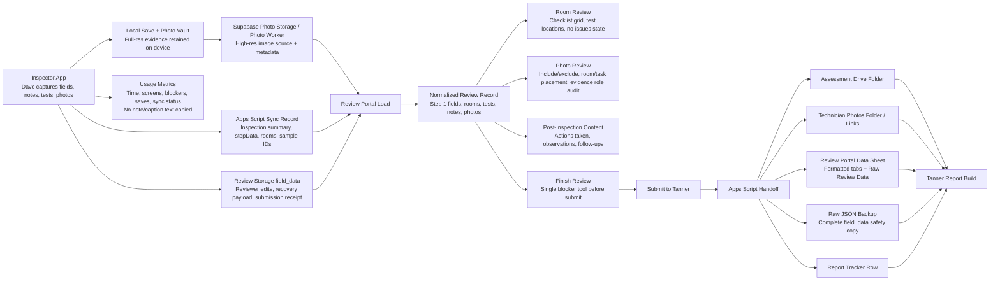

# InHaus Inspection Data Flow

Current local build reference: Inspector App `v149`, Review Portal `V48`.

## What Each Fix Protects

- `v149` app photo metadata keeps `photoKey`, `photoRole`, `sectionLabel`, and high-res source fields with every photo so evidence does not become anonymous later.
- `V48` portal photo placement blocks submit when key evidence photos are not assigned to a usable room/task.
- `V47` portal test-location cue makes missing Q-Trak/Breeze locations obvious inside the room card.
- Handoff backup creates both formatted review data and raw unfiltered review data so Tanner can recover anything even if a formatted tab misses a field.
- Usage tracking creates coaching data: time in app, time in portal, save counts, blockers, photo counts, and sync failures without storing private note text in the activity log.

## Failure Points To Watch

- If a photo has no high-res source or storage path, it is evidence at risk.
- If a key evidence photo is only labeled `Before`, `After`, or `ATP` without a room/task destination, it should block submit.
- If review list photo count and photo service count disagree, trust the photo service and flag the mismatch.
- If Tanner Package Check has no folder or Review Portal Data sheet, the handoff is not complete even if review notes exist.
- If `Raw Review Data` is missing from the Drive spreadsheet, the safety backup did not run.
